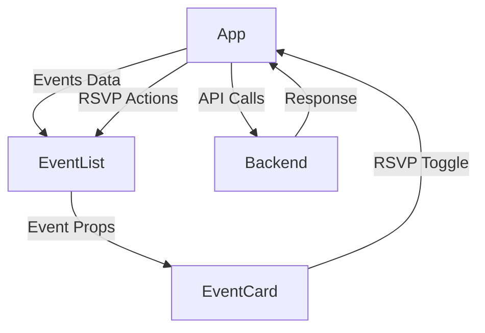

# Event RSVP Application -  Stephan Volynets

> *A Modern, Responsive Client sided  React Application for managing event RSVPs w/ realtime updates and an intuitive user interface.*

## Project Overview

This application provides a seamless event management experience with features including:

- 🎪 Dynamic event listing with responsive grid layout
- 🔄 Real-time RSVP updates
- 💫 Smooth animations and transitions
- 🎨 Modern, accessible UI with Chakra UI
- 📱 Full responsive design
- ⚡ Optimized performance with React

## Technical Stack

- **Frontend**: React, Chakra UI, Framer Motion
- **Backend**: Express.js, MongoDB
- **State Management**: React Hooks
- **API Communication**: Axios
- **Styling**: Chakra UI + Custom Theme
- **Animation**: Framer Motion

## Performance Optimizations

- ***Lazy loading of components***
- ***Optimized re-renders***, minimizing unecessary renders
- ***Debounced API calls***, reducing number of API calls
- ***Skeleton loading states***
- ***Image optimization***

## Component Architecture

### Component Tree
```
App
├── ChakraProvider (Theme)
└── Container
    ├── Header
    └── EventList
        ├── LoadingSkeleton
        └── EventCard
            ├── Event Details
            └── RSVP Button
```

### Data Flow



## Data Management

### API Integration

```javascript
// Example API call implementation
const fetchEvents = async () => {
  try {
    const response = await axios.get("http://localhost:8080/api/events");
    setEvents(response.data);
  } catch (err) {
    // Error handling
  }
};
```

### API Endpoints
**Response Format: Newly created event object.**

| Endpoint | Method | Description |
|----------|--------|-------------|
| `/api/events` | GET | Fetch all events |
| `/api/events/:id/headCount/rsvp` | POST | RSVP to an event |
| `/api/events/:id/headCount/unrsvp` | POST | Cancel RSVP |

### Database Schema:
**Events Collection**

> Each document in the `events` collection has the following schema:

- `_id`: ObjectId - Unique identifier for the event.
- `name`: String - Name of the event.
- `description`: String - Description of the event.
- `date`: Date - Date when the event is scheduled.
- `location`: String - Location where the event will take place.
- `headCount`: Integer - Number of people who have RSVPed to the event.

Example Document:
```json
{
  "_id": ObjectId("..."),
  "name": "Ithaca Farmers Market",
  "description": "A gathering of local farmers and artisans. Fresh produce, handmade crafts, and more.",
  "date": "2023-07-15",
  "location": "Ithaca Farmers Market Pavilion",
  "headCount": 0
}

## React Hooks Usage

### State Management
```javascript
// Core state hooks
const [events, setEvents] = useState([]);
const [loading, setLoading] = useState(false);
const [userRSVPs, setUserRSVPs] = useState({});
```

### Effect Patterns
```javascript
// Data fetching effect
useEffect(() => {
  const fetchEvents = async () => {
    setLoading(true);
    try {
      const response = await axios.get("http://localhost:8080/api/events");
      setEvents(response.data);
    } finally {
      setLoading(false);
    }
  };
  fetchEvents();
}, []);
```

## User Interface

### Design System
- **Theme**: Custom Chakra UI theme with Inter font
- **Colors**: Dynamic color scheme with gradient accents
- **Components**: Reusable, accessible components
- **Animations**: Framer Motion for smooth transitions

### Key Features
1. **Responsive Grid Layout**
   - Adaptive columns based on screen size
   - Maintains symmetry with filler cards

2. **Interactive Cards**
   - Hover animations
   - Loading states
   - RSVP status indicators

3. **Accessibility**
   - ARIA labels
   - Keyboard navigation
   - Screen reader support

### User Flow
1. User views event grid
2. Hovers over event for more details
3. Clicks RSVP button
4. Receives confirmation toast
5. Sees updated attendance count

## Getting Started

### Prerequisites
- Node.js (v14 or higher)
- MongoDB

### Installation

1. Clone the repository:
```bash
git clone <repository-url>
```

2. Install dependencies:
```bash
# Install client dependencies
cd client
npm install

# Install server dependencies
cd ../server
npm install
```

3. Configure environment:
```bash
# Create .env file in server directory
echo "PORT=8080" > .env
```

### Running Locally

1. Start MongoDB:
```bash
mongosh init.mongo.js
```

2. Start the server:
```bash
cd server
npm run dev
```

3. Start the client:
```bash
cd client
npm start
```

The application will be available at `http://localhost:3000`.

# Contributing

1. Fork the repository
2. Create your feature branch
3. Commit your changes
4. Push to the branch
5. Create a Pull Request


git config --global user.email "svv6@cornell.edu"
  git config --global user.name "StephanVolynets"
