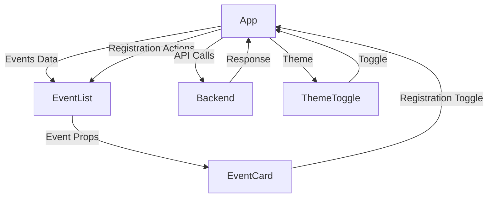

<<<<<<< HEAD
# Cornell Boxing Club Event Registration App

> ***A Modern, Responsive React Application for managing Cornell Boxing Club event registrations with real-time updates and an intuitive user interface.***

<h1 align="center">Snapshot</h1>
=======
# Cornell Boxing Club Event Registration App 
> Created by **Stephan Volynets**
>> A _modern, responsive full stack single page application_ for managing Cornell Boxing Club member event registrations, with real time updates and an intuitive user interface.
>>> This was my final project for [INFO 2310](https://classes.cornell.edu/browse/roster/SP25/class/INFO/2310).   Special Thanks to [Professor Kyle Harms](https://kharms.infosci.cornell.edu/index.html) for teaching me Client Side Rendering & all things HTTP communication! 

>>>>>>> 27da3e054b59e2107b7a2b03360614bc8ab5bb59

<p>
   
        <br>
</p>

</p>
 <p align="center">
    
 </p>

# Project Overview

This application provides a seamless boxing event management experience with features including:

- 🥊 Dynamic boxing event listing with consistent card height layout
<<<<<<< HEAD
- 🔄 Real-time registration updates
=======
- 🔄 Real time registration updates
>>>>>>> 27da3e054b59e2107b7a2b03360614bc8ab5bb59
- 💫 Smooth animations and transitions
- 🌙 Dark/Light theme toggle
- 🎨 Cornell Boxing themed UI with Chakra UI
- 📱 Full responsive design
- ⚡ Optimized performance with React

## Technical Stack

- **Frontend**: React, Chakra UI, Framer Motion
- **Backend**: Express.js, MongoDB
- **State Management**: React Hooks
- **API Communication**: Axios
- **Styling**: Chakra UI + Custom Boxing Theme
- **Animation**: Framer Motion for card and theme animations

## Performance Optimizations

- **Fixed height card components** for consistent UI regardless of content length
- **Optimized re-renders** with proper state management
- **Efficient API calls** for registration updates
- **Skeleton loading states** during data fetch
- **Responsive design** for all screen sizes

## Component Architecture

### Component Tree
```
App
├── ChakraProvider (Theme)
└── Container
    ├── ThemeToggle (Dark/Light Mode)
    ├── Header
    ├── EventList
    │   ├── LoadingSkeleton
    │   └── EventCard
    │       ├── Event Details
    │       ├── Boxing Icons
    │       └── Registration Button
    └── Footer
```

### Data Flow


## Data Management

### API Integration

```javascript
// Example API call implementation
const fetchEvents = async () => {
  try {
    setLoading(true);
    const response = await axios.get("http://localhost:8080/api/events");
    setEvents(response.data);
  } catch (err) {
    toast({
      title: "Error",
      description: "Failed to load events",
      status: "error",
      duration: 5000,
      isClosable: true,
    });
  } finally {
    setLoading(false);
  }
};
```

### API Endpoints

| Endpoint | Method | Description |
|----------|--------|-------------|
| `/api/events` | GET | Fetch all boxing events |
| `/api/events/:id/headCount/rsvp` | POST | Register for an event |
| `/api/events/:id/headCount/unrsvp` | POST | Cancel event registration |

### Database Schema:
**Events Collection**

> Each document in the `events` collection has the following schema:

- `_id`: ObjectId - Unique identifier for the event
- `name`: String - Name of the boxing event
- `description`: String - Description of the event
- `date`: Date - Date when the event is scheduled
- `location`: String - Location where the boxing event will take place
- `headCount`: Integer - Number of fighters who have registered for the event
- `rsvpEmails`: Array - List of Cornell emails that have registered (optional)

Example Document:
```json
{
  "_id": ObjectId("..."),
  "name": "Boxing Basics Workshop",
  "description": "Learn the fundamentals of boxing: stance, footwork, and jab training for beginners.",
  "date": "2025-05-15",
  "location": "Cornell Boxing Gym, Ithaca",
  "headCount": 12,
  "rsvpEmails": ["student1@cornell.edu", "student2@cornell.edu"]
}
```

## React Hooks Usage

### State Management
```javascript
// Core state hooks
const [events, setEvents] = useState([]);
const [loading, setLoading] = useState(false);
const [userRSVPs, setUserRSVPs] = useState({});
const { colorMode, toggleColorMode } = useColorMode();
```

### Effect Patterns
```javascript
// Data fetching effect
useEffect(() => {
  const fetchEvents = async () => {
    setLoading(true);
    try {
      const response = await axios.get("http://localhost:8080/api/events");
      setEvents(response.data);
    } catch (err) {
      toast({
        title: "Error",
        description: "Failed to load events",
        status: "error",
        duration: 5000,
        isClosable: true,
      });
    } finally {
      setLoading(false);
    }
  };

  fetchEvents();
}, [toast]);
```

## User Interface

### Design System
- **Theme**: Custom Chakra UI theme with Cornell Boxing Club color scheme
- **Colors**: Red, black, and blue accents with dark/light mode support
<<<<<<< HEAD
- **Components**: Boxing-themed icons and consistent card layout
=======
- **Components**: Boxing themed icons and consistent card layout
>>>>>>> 27da3e054b59e2107b7a2b03360614bc8ab5bb59
- **Typography**: Enhanced readability with optimized font styles
- **Animations**: Smooth transitions and hover effects

### Key Features

1. **Fixed-Height Card Layout**
   - Consistent 450px height cards regardless of content
<<<<<<< HEAD
   - Well-structured content areas with appropriate spacing
   - Boxing-themed icons for better visual hierarchy
=======
   - Well structured content areas with appropriate spacing
   - Boxing themed icons for better visual hierarchy
>>>>>>> 27da3e054b59e2107b7a2b03360614bc8ab5bb59

2. **Dark Mode Integration**
   - Complete theme support with appropriate color shifts
   - Interactive toggle button in the header area
   - Preserves readability in both modes

3. **Registration Experience**
   - Interactive buttons with visual feedback
   - Cornell email validation for registration
   - Confirmation system with toast notifications

4. **Accessibility**
   - ARIA labels throughout the interface
   - Keyboard navigation support
   - Screen reader compatible components
   - High contrast text in both light and dark modes

### User Flow
1. User views boxing events in a clean, consistent grid
2. Toggles between light and dark mode as preferred
3. Clicks registration button for an event of interest
4. Enters Cornell email for validation
5. Receives confirmation with visual feedback
6. Sees updated fighter count for the event

## Getting Started

### Prerequisites
- Node.js (v14 or higher)
- MongoDB

### Installation

1. Clone the repository:
```bash
git clone <repository-url>
```

2. Install dependencies:
```bash
# Install client dependencies
cd client
npm install

# Install server dependencies
cd ../server
npm install
```

3. Configure environment:
```bash
# Create .env file in server directory
echo "PORT=8080" > .env
```

### Running Locally

1. Initialize the database with boxing events:
```bash
cd server
mongosh init.mongo.js
```

2. Start the server:
```bash
cd server
npm run dev
```

3. Start the client:
```bash
cd client
npm start
```

The application will be available at `http://localhost:3000`.

## Project Structure

```
EVENT-RSVP-APP-MERN-2/
├── client/                 # React frontend
│   ├── public/             # Static files
│   └── src/
│       ├── components/     # UI components
│       │   ├── Footer.jsx
│       │   ├── Header.jsx
│       │   ├── ReservationModal.jsx
│       │   └── ThemeToggle.jsx
│       ├── App.jsx         # Main application component
│       ├── EventCard.jsx   # Boxing event card component
│       ├── EventList.jsx   # Event grid display
│       ├── index.jsx       # Entry point
│       └── theme.js        # Chakra UI theme configuration
│
└── server/                 # Express backend
    ├── db/                 # Database connection
    │   └── conn.mjs
    ├── init.mongo.js       # Database initialization with boxing events
    └── server.mjs          # Express API routes and server configuration
```

<<<<<<< HEAD
## Deployment

This application can be deployed using several cloud platforms:

### Deploying to Heroku

1. Install Heroku CLI and login:
```bash
npm install -g heroku
heroku login
```

2. Create a new Heroku app:
```bash
heroku create cornell-boxing-app
```

3. Add MongoDB Atlas:
```bash
heroku addons:create mongolab
```

4. Deploy:
```bash
git push heroku main
```

### Deploying to Render

1. Sign up at [render.com](https://render.com/)
2. Connect your GitHub repository
3. Configure environment variables:
   - `NODE_ENV`: production
   - `MONGODB_URI`: Your MongoDB connection string
   - `MONGODB_DB_NAME`: boxing-events

### Deploying to Railway

1. Sign up at [railway.app](https://railway.app/)
2. Import your GitHub repository
3. Add MongoDB plugin
4. Configure environment variables
5. Deploy

### Production Considerations

- Set up proper environment variables
- Configure MongoDB Atlas for database
- Enable HTTPS for secure connections
- Set up proper error logging and monitoring
- Configure proper CORS settings for production

=======
>>>>>>> 27da3e054b59e2107b7a2b03360614bc8ab5bb59
## Contributing

1. Fork the repository
2. Create your feature branch
3. Commit your changes
4. Push to the branch
5. Create a Pull Request
<<<<<<< HEAD
=======

> Special Thanks to [Professor Kyle Harms](https://kharms.infosci.cornell.edu/index.html) for teaching me client side rendering & all things HTTP communication!
>>>>>>> 27da3e054b59e2107b7a2b03360614bc8ab5bb59
